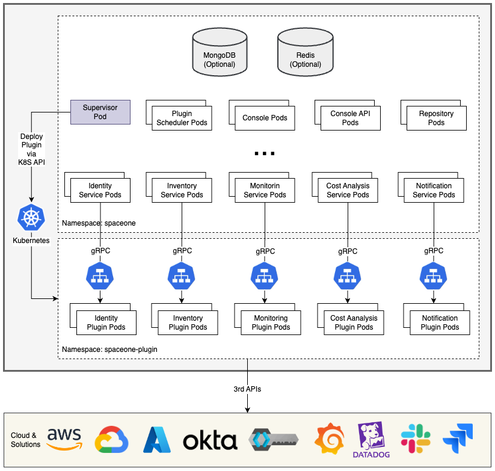

# Cloudforet Helm Charts 
A Helm Chart for Cloudforet `1.12`.

## Prerequisites
- Kubernetes 1.21+
- Helm 3.2.0+
- Service Domain & SSL Certificate (optional)
  - Console: `console.example.com`
  - REST API: `*.api.example.com`
  - gRPC API: `*.grpc.example.com`
  - Webhook: `webhook.example.com`
- MongoDB 5.0+ (optional)

### Cloudforet Architecture


## Installation
You can install the Cloudforet using the following the steps.

### 1) Add Helm Repository
```bash
helm repo add cloudforet https://cloudforet-io.github.io/charts
helm repo update
helm search repo cloudforet
```

### 2) Create Namespaces
```bash
kubectl create ns spaceone
kubectl create ns spaceone-plugin
```
If you want to use only one namespace, you don't create the `spaceone-plugin` namespace.

### 3) Create Role and RoleBinding
First, download the [rbac.yaml](examples/rbac.yaml) file.
```bash
wget https://raw.githubusercontent.com/cloudforet-io/charts/master/examples/rbac.yaml -O rbac.yaml
```
And execute the following command.
```bash
kubectl apply -f rbac.yaml -n spaceone-plugin
```

### 4) Install Cloudforet Chart
```bash
helm install cloudforet cloudforet/spaceone -n spaceone
```

After executing the above command, check the status of the pod.
```bash
kubectl get pod -n spaceone

NAME                                       READY   STATUS             RESTARTS      AGE
board-64f468ccd6-v8wx4                     1/1     Running            0             4m16s
config-6748dc8cf9-4rbz7                    1/1     Running            0             4m14s
console-767d787489-wmhvp                   1/1     Running            0             4m15s
console-api-846867dc59-rst4k               2/2     Running            0             4m16s
console-api-v2-rest-79f8f6fb59-7zcb2       2/2     Running            0             4m16s
cost-analysis-5654566c95-rlpkz             1/1     Running            0             4m13s
cost-analysis-scheduler-69d77598f7-hh8qt   0/1     CrashLoopBackOff   3 (39s ago)   4m13s
cost-analysis-worker-68755f48bf-6vkfv      1/1     Running            0             4m15s
cost-analysis-worker-68755f48bf-7sj5j      1/1     Running            0             4m15s
cost-analysis-worker-68755f48bf-fd65m      1/1     Running            0             4m16s
cost-analysis-worker-68755f48bf-k6r99      1/1     Running            0             4m15s
dashboard-68f65776df-8s4lr                 1/1     Running            0             4m12s
file-manager-5555876d89-slqwg              1/1     Running            0             4m16s
identity-6455d6f4b7-bwgf7                  1/1     Running            0             4m14s
inventory-fc6585898-kjmwx                  1/1     Running            0             4m13s
inventory-scheduler-6dd9f6787f-k9sff       0/1     CrashLoopBackOff   4 (21s ago)   4m15s
inventory-worker-7f6d479d88-59lxs          1/1     Running            0             4m12s
mongodb-6b78c74d49-vjxsf                   1/1     Running            0             4m14s
monitoring-77d9bd8955-hv6vp                1/1     Running            0             4m15s
monitoring-rest-75cd56bc4f-wfh2m           2/2     Running            0             4m16s
monitoring-scheduler-858d876884-b67tc      0/1     Error              3 (33s ago)   4m12s
monitoring-worker-66b875cf75-9gkg9         1/1     Running            0             4m12s
notification-659c66cd4d-hxnwz              1/1     Running            0             4m13s
notification-scheduler-6c9696f96-m9vlr     1/1     Running            0             4m14s
notification-worker-77865457c9-b4dl5       1/1     Running            0             4m16s
plugin-558f9c7b9-r6zw7                     1/1     Running            0             4m13s
plugin-scheduler-695b869bc-d9zch           0/1     Error              4 (59s ago)   4m15s
plugin-worker-5f674c49df-qldw9             1/1     Running            0             4m16s
redis-566869f55-zznmt                      1/1     Running            0             4m16s
repository-8659578dfd-wsl97                1/1     Running            0             4m14s
secret-69985cfb7f-ds52j                    1/1     Running            0             4m12s
statistics-98fc4c955-9xtbp                 1/1     Running            0             4m16s
statistics-scheduler-5b6646d666-jwhdw      0/1     CrashLoopBackOff   3 (27s ago)   4m13s
statistics-worker-5f9994d85d-ftpwf         1/1     Running            0             4m12s
supervisor-scheduler-74c84646f5-rw4zf      2/2     Running            0             4m16s
```

> Scheduler pods are in `CrashLoopBackOff` or `Error` state. This is because the setup is not complete.

### 5) Initialize the Configuration  
First, download the [initializer.yaml](examples/initializer.yaml) file.
```bash
wget https://raw.githubusercontent.com/cloudforet-io/charts/master/examples/initializer.yaml -O initializer.yaml
```
And execute the following command.
```bash
helm install initializer cloudforet/spaceone-initializer -n spaceone -f initializer.yaml
```

For more information about the initializer, please refer the [spaceone-initializer](https://github.com/cloudforet-io/spaceone-initializer).

### 6) Set the Helm Values and Upgrade the Chart
Complete the initialization, you can get the system token from the initializer pod logs.
```bash
kubectl logs initialize-spaceone-okz9g-rsxc2 -n spaceone

...
TASK [Print Admin API Key] *********************************************************************************************
"{TOKEN}"

FINISHED [ ok=23, skipped=0 ] ******************************************************************************************

FINISH SPACEONE INITIALIZE
```

First, copy this TOKEN, then Create the `values.yaml` file and paste it to the TOKEN.
```yaml
console:
  production_json:
    # If you don't have a service domain, you refer to the following 'No Domain & IP Access' example.
    CONSOLE_API:
      ENDPOINT: https://console.api.example.com       # Change the endpoint
    CONSOLE_API_V2:
      ENDPOINT: https://console-v2.api.example.com    # Change the endpoint

global:
  shared_conf:
    TOKEN: '{TOKEN}'                                    # Change the system token
```

For more advanced configuration, please refer the following the links.
- Documents
  - [Parameters](docs/parameters.md)
- Examples
  - [Default Values](https://github.com/cloudforet-io/spaceone/blob/master/deploy/helm/values.yaml)
  - Infra & Kubernetes
    - [Change Pod Replica](examples/values/change_pod_replica_values.yaml)
    - [Node Selector](examples/values/node_selector_values.yaml)
    - [Change Namespace](examples/values/change_namespace_values.yaml)
    - [One Namespace](examples/values/one_namespace_values.yaml)
    - Set Private Docker Registry
    - Set HTTP Proxy
    - Set Container Resource Request & Limit
  - Application
    - [Set External Database](examples/values/external_db_values.yaml)
    - [Change Database Name](examples/values/change_db_name_values.yaml)
    - [Multi-Tenancy Mode](examples/values/multi_tenancy_mode_values.yaml)
    - Enable Monitoring Webhook & Notification
    - Change Secret Storage
    - Set Private Assets & Docs
    - [Set OpenTelemetry](examples/values/set_opentelemetry_values.yaml)

After editing the `values.yaml` file, upgrade the helm chart.
```bash
helm upgrade cloudforet cloudforet/spaceone -n spaceone -f values.yaml
kubectl delete po -n spaceone -l app.kubernetes.io/instance=cloudforet
```

### 7) Check the status of the pods
```bash
kubectl get pod -n spaceone
```

If all pods are in `Running` state, the setup is complete.

### 8) Configure Ingress
After the installation, you need to configure the ingress to access the console and API.

- [AWS](docs/ingress/aws.md)
- [On-premise](docs/ingress/on_premise.md)
- [Port Forwarding (No Ingress)](docs/ingress/port_forwarding.md)

## Upgrade
You can upgrade the cloudforet from under 1.12 previous version to 1.12 latest version.

> **DB Migration Required**  
Before upgrade, please check [DB-Migration](https://github.com/cloudforet-io/db-migration/) to migrate DataBase.  
By migrate script, cost-analysis data and budget data will deleted by script.  Please check it and backup data if you need.

### 1) Upgrade value files
`Dashboard` is released. So, remove following lines if exists.

- Remove `DASHBOARD_ENABLED` lines in `Console` yaml file.
  - `console.production_json.DASHBOARD_ENABLED`

```diff
console:
  production_json:
    ...
-   DASHBOARD_ENABLED:
-     - domain-1234567890ab
```

From version 1.12, `Identity` support SMTP and it is Required. So, please add following lines.
```diff
identity:
  ...
  application_grpc:
+     EMAIL_CONSOLE_DOMAIN: https://{domain_name}.console.example.com
+     EMAIL_SERVICE_NAME: Cloudforet
+     RESET_PASSWORD_TYPE: ACCESS_TOKEN

    CONNECTORS:
      ...
+     SMTPConnector:
+         host: {host}
+         port: {prot}
+         user: {account_id}
+         password: {password}
+         from_email: {email address to reveive}
      ...
```

### 2) Upgrade the Helm Chart

1. Upgrade helm repository 
```bash
helm repo update
```

2. Upgrade cloudforet with helm
```bash
helm upgrade cloudforet cloudforet/spaceone -n spaceone -f values.yaml
```

3. Migrate Database using [DB-Migration](https://github.com/cloudforet-io/db-migration/)
> **Please check version.**  
This guide support upgrade version from 1.11 to 1.12. Older versions need to migrate each script step by step.
```bash
/db-migration/src/migrate.py 1.12.0 -f config.yaml
/db-migration/src/migrate.py 1.12.1 -f config.yaml
/db-migration/src/migrate.py 1.12.2 -f config.yaml
```

4. After Migration, delete all pods for restart.

```bash
kubectl delete po -n spaceone -l app.kubernetes.io/instance=cloudforet
```

## Uninstall
You can uninstall the cloudforet with the following command.

### 1) Delete the Helm Chart
```bash
helm delete cloudforet -n spaceone
helm delete cloudforet-initializer -n spaceone
```

### 2) Delete the Ingress
```bash
kubectl delete ingress --all -n spaceone
```

### 4) Delete all plugins
```bash
kubectl delete deployment --all -n spaceone-plugin
kubectl delete service --all -n spaceone-plugin
```

### 5) Delete cloudforet namespaces
```bash
kubectl delete namespace spaceone
kubectl delete namespace spaceone-plugin
```