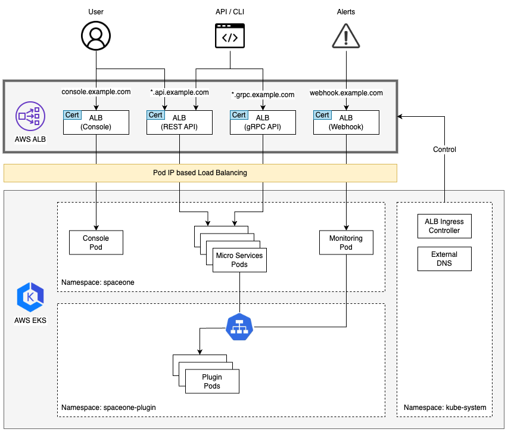

## AWS Architecture


If you want to learn more about the **_Pod IP based Load Balancing_**, please refer to the following link.
- Traffic Modes in [Application load balancing on Amazon EKS](https://docs.aws.amazon.com/eks/latest/userguide/alb-ingress.html) 

## Configuration
[Kubernetes Ingress](https://kubernetes.io/docs/concepts/services-networking/ingress/) is a resource that manages external access to the services in a cluster, typically HTTP.

You can create the ingress using the following steps.

### 1) Create Hosted Zone in Route53
First, you need to purchase the service domain. (e.g. `example.com`)

After that, [create a public hosted zone](https://docs.aws.amazon.com/Route53/latest/DeveloperGuide/CreatingHostedZone.html) in Route53 and delegate the nameserver from the provider to Route53.

### 2) Install ALB Ingress Controller and External DNS
The ALB Ingress Controller and External DNS are required to automatically create DNS records and ALB through the `kubernetes ingress`.

- [ALB Ingress Controller](https://kubernetes-sigs.github.io/aws-alb-ingress-controller/)
- [External DNS](https://github.com/kubernetes-sigs/external-dns)

### 3) Create Certificate in AWS Certificate Manager
You need to create a public certificate for the ALB to use HTTPS.

[Request a public certificate](https://docs.aws.amazon.com/acm/latest/userguide/gs-acm-request-public.html) and add the following FQDN.
- `console.example.com`
- `*.api.example.com`
- `*.grpc.example.com` (optional)
- `webhook.example.com` (optional)

> When creating a certificate, you need to copy the certificate ARN and use it when creating the ingress.

### 4) Create Ingress
First, you need to download all the ingress files and replace the `certificate-arn` and `hostname` with your own.

- Console: [console_ingress.yaml](../../examples/ingress/aws/console_ingress.yaml)
- REST API: [rest_api_ingress.yaml](../../examples/ingress/aws/rest_api_ingress.yaml)
- gRPC API: [grpc_api_ingress.yaml](../../examples/ingress/aws/grpc_api_ingress.yaml)
- Monitoring Webhook: [monitoring_webhook_ingress.yaml](../../examples/ingress/aws/monitoring_webhook_ingress.yaml)

And then, apply the ingress files.
```bash
kubectl apply -f console_ingress.yaml -n spaceone
kubectl apply -f rest_api_ingress.yaml -n spaceone
kubectl apply -f grpc_api_ingress.yaml -n spaceone
kubectl apply -f monitoring_webhook_ingress.yaml -n spaceone
```

> `gRPC API` and `Monitoring Webhook` are optional. If you don't need it, you don't need to apply it.

### 5) Connect to the Console
You can access the console using the following URL.
- https://console.example.com