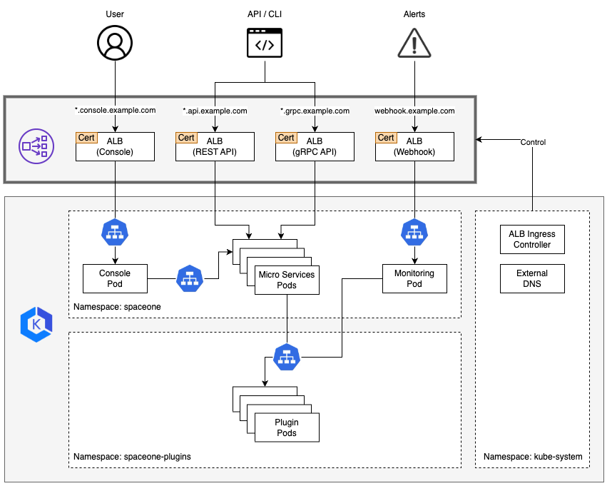

## AWS Architecture


If you want to learn more about the **_Pod IP based Load Balancing_**, please refer to the following link.
- Traffic Modes in [Application load balancing on Amazon EKS](https://docs.aws.amazon.com/eks/latest/userguide/alb-ingress.html) 

## Configuration
You can create the ingress using the following steps.

### 1) Install ALB Ingress Controller and External DNS  
- [ALB Ingress Controller](https://kubernetes-sigs.github.io/aws-alb-ingress-controller/)
- [External DNS](https://github.com/kubernetes-sigs/external-dns)
  
### 2) Create Route53 Hosted Zone
- [Creating a Public Hosted Zone](https://docs.aws.amazon.com/Route53/latest/DeveloperGuide/CreatingHostedZone.html)

> Before creating the hosted zone, you need to purchase a domain and delegate nameserver from the provider to Route53. 

### 3) Create ACM Certificate
- [Request a public certificate](https://docs.aws.amazon.com/acm/latest/userguide/gs-acm-request-public.html)

When creating a certificate, you need to add the following FQDN.
- `*.console.example.com`
- `*.api.example.com`
- `*.grpc.example.com`
- `webhook.example.com`

### 4) Create Ingress
- Console: [console_ingress.yaml](../../examples/ingress/aws/console_ingress.yaml)
- REST API: [rest_api_ingress.yaml](../../examples/ingress/aws/rest_api_ingress.yaml)
- gRPC API: [grpc_api_ingress.yaml](../../examples/ingress/aws/grpc_api_ingress.yaml)
- Monitoring Webhook: [monitoring_webhook_ingress.yaml](../../examples/ingress/aws/monitoring_webhook_ingress.yaml)

```bash
kubectl apply -f console_ingress.yaml -n spaceone
kubectl apply -f console_api_ingress.yaml -n spaceone
kubectl apply -f grpc_api_ingress.yaml -n spaceone
kubectl apply -f monitoring_webhook_ingress.yaml -n spaceone  // If you want to enable monitoring webhook, apply this.
```

### 5) Connect to the Console
You can access the console using the following URL.
- https://spaceone.console.example.com