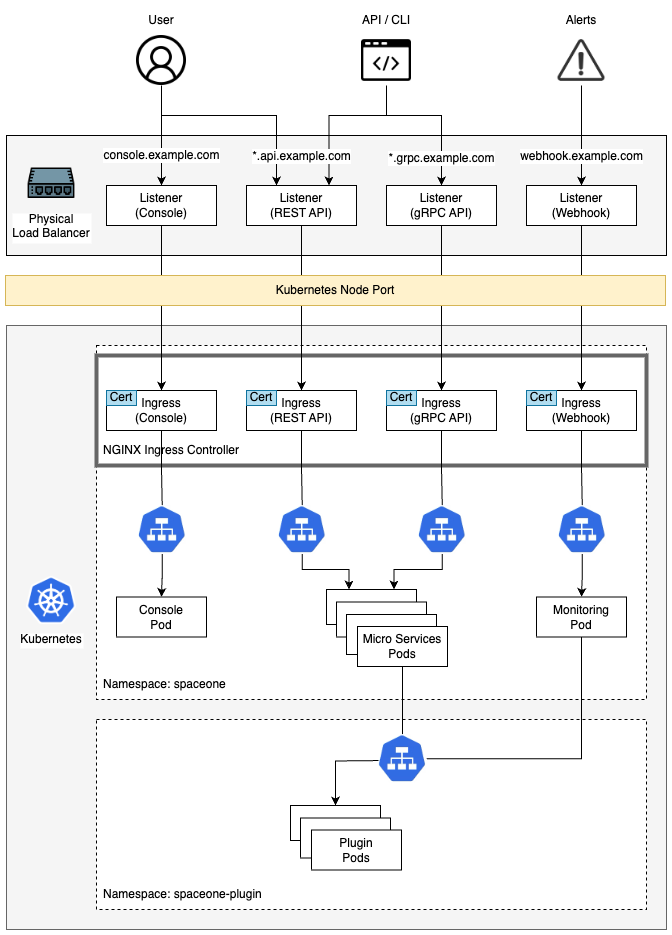

## On-premise Architecture


## Configuration
You can create the ingress using the following steps.

### 1) Install Nginx Ingress Controller  
- [Nginx Ingress Controller](https://kubernetes.github.io/ingress-nginx/deploy/)
  
### 2) Prepare Certificates and Create Secret
First, you need to prepare the certificate for the following FQDN.
- `console.example.com`
- `*.api.example.com`
- `*.grpc.example.com` (Optional)
- `webhook.example.com` (Optional)

After that, download the [certificate_secret.yaml](../../examples/ingress/on_premise/certificate_secret.yaml) and replace the certificate and key with your own.

```bash
kubectl apply -f certificate_secret.yaml -n spaceone
```

### 3) Create Ingress
First, you need to download all the ingress files and replace the `hostname` with your own.

- Console: [console_ingress.yaml](../../examples/ingress/aws/console_ingress.yaml)
- REST API: [rest_api_ingress.yaml](../../examples/ingress/aws/rest_api_ingress.yaml)
- gRPC API (optional): [grpc_api_ingress.yaml](../../examples/ingress/aws/grpc_api_ingress.yaml)
- Monitoring Webhook (optional): [monitoring_webhook_ingress.yaml](../../examples/ingress/aws/monitoring_webhook_ingress.yaml)

```bash
kubectl apply -f console_ingress.yaml -n spaceone
kubectl apply -f console_api_ingress.yaml -n spaceone
kubectl apply -f grpc_api_ingress.yaml -n spaceone
kubectl apply -f monitoring_webhook_ingress.yaml -n spaceone  // If you want to enable monitoring webhook, apply this.
```

>> gRPC API and Monitoring Webhook are optional. If you don't need it, you don't need to apply it.

### 4) Connect to the Console
You can access the console using the following URL.
- https://console.example.com